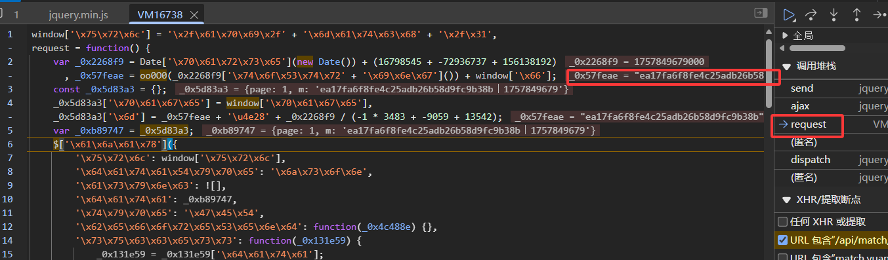
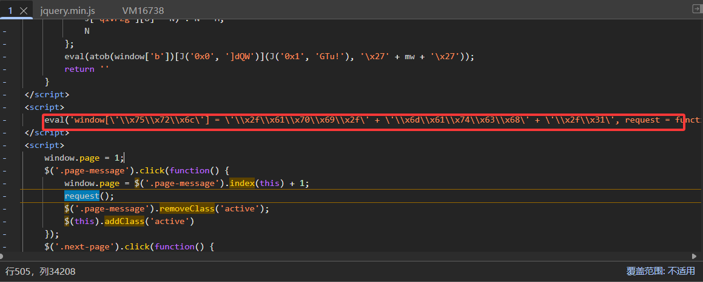
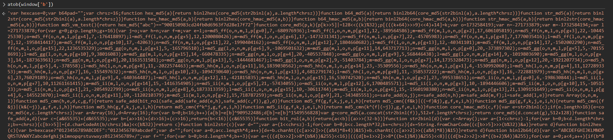
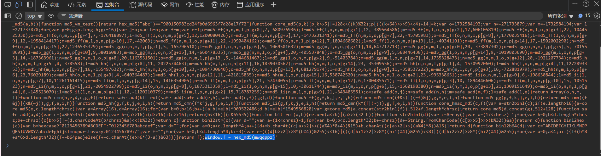
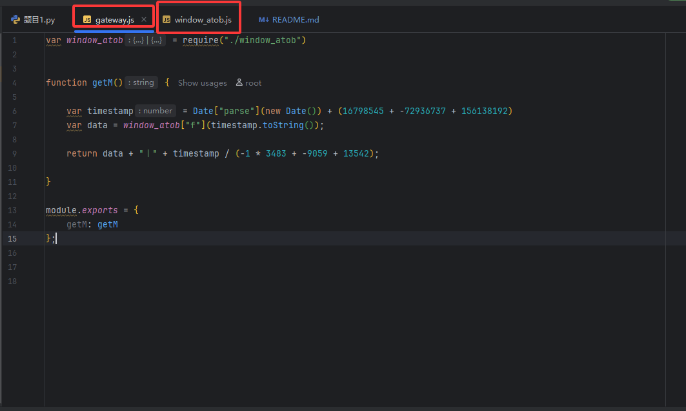

# 一、下XHR断点

将 "https://match.yuanrenxue.cn/api/match/1" 添加至XHR断点

# 二、跟栈



发现这里出现了加密字符串，这里即为入口函数，并且可以注意到这个文件的名字为VM + 数字，说明这个文件不是
服务器传过来的，而是由代码生成的，**需要重点注意一下生成这个文件的地方**
我们需要 oo0O0() 和 window.f 来破解这个加密，

**oo0O0()**返回的是"",所以主要目标是**window.f**

# 三、逆向分析
1、再往上跟一级，进入1这个文件，可以发现入口函数所在的文件是由1这个文件里面执行eval函数生成的


2、于是仔细研究1这个文件，发现里面有oo0O0()这个函数，
而且在这个函数的最底部,有这样一行代码：
```JS
eval(atob(window['b'])[J('0x0', ']dQW')](J('0x1', 'GTu!'), '\x27' + mw + '\x27'));
```
很可疑！！！
将其用控制台打印一下可得到：J('0x0', ']dQW') ===> replace

atob(window['b']):

注意在这个文本最后有：window.f = hex_md5(mwqqppz)

**window.f**已找到，将这一大串封装为字符串的代码转化为js文件，得到window_atob文件。
然后结合gateway.js文件运行一下，不报错，且输出正确的加密格式



OK，本题done！